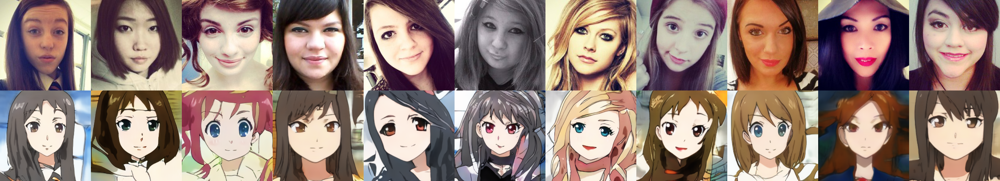

# U-GAT-IT

This an implementation of [U-GAT-IT: Unsupervised Generative Attentional Networks with Adaptive Layer-Instance Normalization for Image-to-Image Translation](https://arxiv.org/abs/1907.10830).

## Cherry picked examples

## Notes

1. The generator is slightly changed to fit training on a 11 GB graphics card.
2. Use `python train.py` for training but set the right configs in `model.py` first.
3. Use `generate.ipynb` for inference after the training.
4. You can download **pretrained** (selfie2anime) checkpoints and logs from [here](https://drive.google.com/drive/folders/1ibTUNfN0NzqaGuS4P3njW-9YB0PJBDA7?usp=sharing).

## Credit

This code is based on the official implementation [znxlwm/UGATIT-pytorch](https://github.com/znxlwm/UGATIT-pytorch) and [taki0112/UGATIT](https://github.com/taki0112/UGATIT).

## Requirements

1. pytorch 1.3
2. numpy 1.17
3. tensorboard 1.15
4. Pillow 6.1
